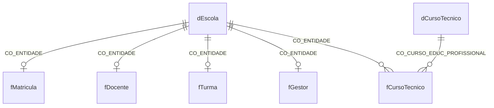

# Modelo analítico

Os filtros fluem das dimensões para os fatos. Escola, matrícula, docente, turma e gestor têm um registro agregado por escola. Curso técnico tem um registro por escola–curso; por isso jamais é unido diretamente aos demais fatos para somar matrículas gerais.

As tabelas `matricula_sexo`, `matricula_raca` e `matricula_idade` são fatos auxiliares separados. Essa separação impede produto cartesiano entre quebras demográficas.
